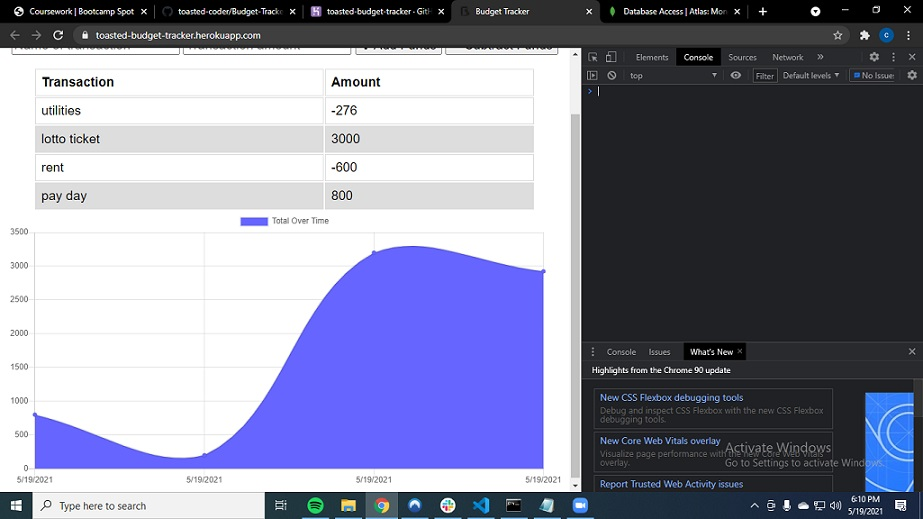

# Budget Tracker

## Table of Contents

- [Description](#description)
- [Installation](#installation)
- [Usage](#usage)
- [Contributors](#contributors)
- [Testing](#testing)
- [Questions](#questions)
- [License](#license)

## Screenshot

## Description

This is a budget tracker with offline capabilities. A user can input their data offline which will update the app database once they go back online.

## Installation

Clone this repo, make sure to run npm i to get all your dependancies.

## Usage

Simple app to monitor income and expenses.

## Contributors

Myself. Big help also from my teachers Alex and Ryan fixing an error after deployment.

## Testing

N/A

## Questions

Email address: christmanholmes21@gmail.com
GitHub username: [toasted-coder](https://github.com/toasted-coder)

## License

